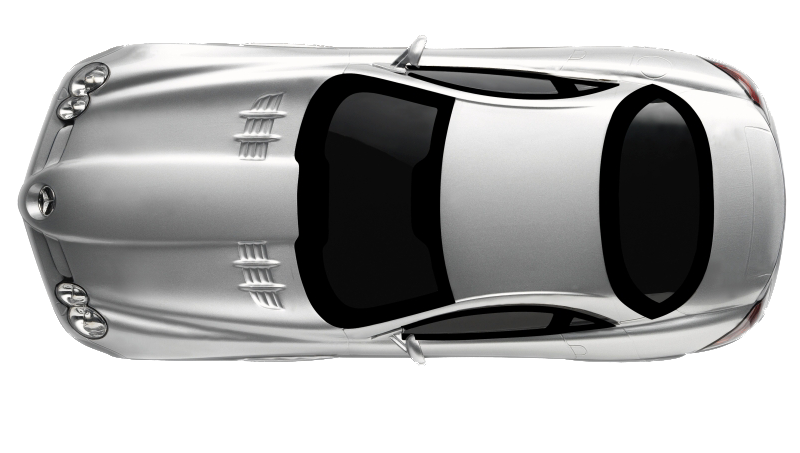

# Interface met CSS

Voor de opdracht moest ik een interactieve interface maken met gebuik van alleen HTML & CSS. hierbij mocht ik ook geen classed/id's gebruiken. Althans zo min mogeljk.
## De opdracht
De opdracht was een interactieve interface maken met Vanilla HTML & CSS. Hierbij mag je geen/weinig classes en id's gebruiken. Ook moeten er 2 nieuwe functies geimplementeerd worden in de interface die sinds kort pas in css beschikbaar is. 
## Stappenplan
### Week 1 
Ik heb verschillende schetsen gemaakt om mijn project vorm te geven.


Hier heb ik schetsen gemaakt die mij een duidelijk inzicht geeft in wat ik allemaal moet gaan maken voor de opdracht. 
Om een begin te maken voor week 2 heb ik alvast de repo aangemaakt met de template files. 

#### Feedback moment:
tijdens dit feedback moment heb ik veel leuke inspiratie gekregen en gegeven. ik en mijn teamgenoten hadden leuke plannen, en we hebben nog wat leuke toevoegingen gedeeld. 

### Week 2 
In week 2 heb ik mijn schetsen omgetoverd van tekeningen tot html elementen. 
```html
<html lang="en">
<head>
    <meta charset="UTF-8">
    <meta name="viewport" content="width=device-width, initial-scale=1.0">
    <title>The ony tiny bit of JS that is allowed - CSS to the Rescue 23/24 - minor WDD</title>

    <link rel="preconnect" href="https://fonts.googleapis.com">
    <link rel="preconnect" href="https://fonts.gstatic.com" crossorigin>
    <link href="https://fonts.googleapis.com/css2?family=Saira:wght@400;700&display=swap" rel="stylesheet">

    <link rel="stylesheet" href="style.css">
    <link rel="icon" type="image/svg+xml" href="../img/favicon.svg">
</head>

<body>
<div>
    <!--  Hier komt de tijd parkeer rem en tijd-->
</div>
<div>
    <!--  Dit zijn de rijmodus-->
    <form>
        <input type="radio" id="sport" name="hallo" value="sport">
        <label for="sport">Sport</label><br>
        <input type="radio" id="comfort" name="hallo" value="comfort">
        <label for="comfort">Comfort</label><br>
        <input type="radio" id="eco" name="hallo" value="eco">
        <label for="eco">Eco</label>
    </form>
</div>

<div>
    <!--  Dit is de toerenteller-->
    <ul>
        <li>1</li>
        <li>2</li>
        <li>3</li>
        <li>4</li>
        <li>5</li>
        <li>6</li>
    </ul>

</div>

<div>
    <!--    hier komt de maps en versnellingsbak-->

</div>


<div>
    <!--  hier komt een tankindicatie, gordel lampje en lichten.-->
</div>

```
om een gode preset van kleuren te hebben, kan je makkelijk globaal alles veranderen. Door deze alvast in de root te zetten kan ik er snel en gemakkelijk mee aan de gang. 
```css
:root {
    --main-wit: #f0f0f0;
    --main-rood: #cd0a2b;
    --main-blauw: #0a92cd;
    --main-grijs: #303841;
    --main-groen: #0bca07;

}

```
Voor de verschillende rijmodus die er zijn, heb ik zelf de icoontjes gemaakt in css. hierbij heb ik gekeken naar de originele icoontjes, en heb ik met mijn eigen kennis (en een beetje googlen) een mooie set gemaakt. 


```css
/*focus en hover state rijmodus*/
input[value="sport"]:hover:after,
input[value="sport"]:checked:after {
display: block;
border-color: var(--main-rood);
background: linear-gradient(180deg, rgb(205, 10, 43) 0%, rgb(0, 0, 0) 100%);
content: "S";
}
input[value="comfort"]:hover:after,
input[value="comfort"]:checked:after{
display:block;
border-color: var(--main-blauw);
background: linear-gradient(180deg, rgb(10, 146.5, 205) 0%, rgb(0, 0, 0) 100%);
content: "C";
}
input[value="eco"]:checked:after,
input[value="eco"]:hover:after{
display:block;
border-color: var(--main-groen);
background: linear-gradient(180deg, rgb(14, 190, 10) 0%, rgb(0, 0, 0) 100%);
content: "E";
}
```

#### Feedbackmoment;
Tijdens dit feedback moment kreeg ik vooral feedback op de buttons. Mijn groepgenoten vonden ze echt nice en vonden ze ook net echt lijken. 

### Week 3 
Ik heb mij deze week bezig gehouden met het maken van de toerenteller. Die heb ik opgebouwd met aparte fieldsets die ik een plek heb gegeven in een grid met een trmplate. Zie hieronder wat ik heb gedaan. 

```html
     <form>
    <fieldset>
        <input type="radio" id="nul" name="toeren" value="nul">
        <label for="nul">0</label>
    </fieldset>
    <fieldset>
        <input type="radio" id="duizend" name="toeren" value="duizend">
        <label for="duizend">1</label>
    </fieldset>
    <fieldset>
        <input type="radio" id="tweeduizend" name="toeren" value="tweeduizend">
        <label for="tweeduizend">2</label>
    </fieldset>
    <fieldset>
        <input type="radio" id="drieduizend" name="toeren" value="drieduizend">
        <label for="drieduizend">3</label>
    </fieldset>
    <fieldset>
        <input type="radio" id="vierduizend" name="toeren" value="vierduizend">
        <label for="vierduizend">4</label></fieldset>
    <fieldset>
        <input type="radio" id="vijfduizend" name="toeren" value="vijfduizend">
        <label for="vijfduizend">5</label>
    </fieldset>
    <fieldset>
        <input type="radio" id="zesduizend" name="toeren" value="zesduizend">
        <label for="zesduizend">6</label>
    </fieldset>
    <fieldset>
        <input type="radio" id="zevenduizend" name="toeren" value="zevenduizend">
        <label for="zevenduizend">7</label>
    </fieldset>
    <fieldset>
        <label>100</label>
    </fieldset>
</form>
```
```css
main>div:nth-of-type(3) >  form  {
    width:35em;
    height:35em;
    display: grid;
    grid-template-areas:
            "a b c d"
            "e h h i"
            "j h h k";
}

#naald {
    width: 0.5em;
    height: 12em;
    background-color: var(--main-speedometerborder);
    position: absolute;
    top:9em;
    left:43em;
    background-color: var(--main-rood);
    position: relative;
    top:-33em!important;
    left:22em;
    transform-origin: bottom center;
    transform:  rotate(-120deg);
    animation: speedup 2s infinite;

    animation: speedup 1s ease-in-out 6s;
}
```
#### Feedbackmoment: 
Tijdens dit feedbackmoment heb ik van Sanne gehoord dat de template met een abc volgorde niet heel overzichtelijk is. Ik ga volgende week deze template aanpassen en daar een logische volgorde op vinden. ook is mij aangeradem om alvast een begin te maken met Nesten van de CSS. Dit zal mijn code goed opschonen en overzichtelijker maken. 

## stap 5 
In deze week ben ik verder gegaan met eht laatste onderdeel wat de rechter widgetbar is. deze bestaal uit 3 div's die content bevatten waar je doorheen kan pijlen of scrollen. 
```html
<div>
    <div>
        <iframe src="https://www.google.com/maps/d/u/0/embed?mid=1ikDymsNK503wBw-qQyOdlKG23ScnWSY&ehbc=2E312F&noprof=1"
                width="500" height="400" style="style.css"></iframe>
    </div>
    <div>
        <iframe src="https://open.spotify.com/embed/playlist/37i9dQZF1DX19xRtMyA5LM?utm_source=generator"
                width="100%" height="380" frameBorder="0" allowfullscreen="" allow="autoplay; clipboard-write;
    encrypted-media; fullscreen; picture-in-picture" loading="lazy"></iframe>
    </div>
    <div>

        <div>
            <p>250</p>
            <p>280[kPa]</p>
        </div>
        
        <div>
            <p>250 </p>
            <p>280 [kPa] </p>
        </div>
    </div>
</div>
```


### Code Nesting
Voor het nesten van mijn CSS File heb ik bijna 50 regels weg kunnen halen en kunnen vervangen door deze methode. Ik vond mijn code hierna veel overzichtelijker en duidelijker om mee te werken. Ik heb hier onder een voorbeeld van hoe ik dat gedaan heb. 

```css
/*hier is de widget aan de rechterkant na het NESTEN*/
main>div:nth-of-type(3) >  form  {
    width:35em;
    height:35em;
    display: grid;
    grid-template-areas:
            "a b c d"
            "e h h i"
            "j h h k";
}
/*nul*/
main>div:nth-of-type(3) >  form > fieldset:first-of-type {
    grid-area:j;
    position: relative;
    left: 1em;
    top:-1em;

}
/*duizend*/
main>div:nth-of-type(3) >  form > fieldset:nth-of-type(2) {
    grid-area:e;
    position: relative;
    top:4em;
}
/*tweeduizend*/
main>div:nth-of-type(3) >  form > fieldset:nth-of-type(3) {
    grid-area:a;
    position: relative;
    /*transform: rotate(35deg);*/
    top:7em;
    left:3em;
}
/*drieduizend*/
main>div:nth-of-type(3) >  form > fieldset:nth-of-type(4) {
    grid-area:b;
    position: relative;
    left: 3em;
    top:3em;
}


/*hier is de widget aan de rechterkant na het NESTEN*/
div:nth-of-type(3) >  form {
    width: 35em;
    height: 35em;
    background: var(--main-speedometer);
    border: var(--main-speedometerborder) solid 0.5em;
    border-radius: 50%;
    margin: 3em;
    display: grid;
    grid-template-areas:
            "twee drie vier vijf"
            "een h h zes"
            "nul h h zeven";
    /*nul*/

    & fieldset:first-of-type {
        grid-area: nul;
        translate: 1em -1em;
    }

    /*duizend*/

    & fieldset:nth-of-type(2) {
        grid-area: een;
        position: relative;
        top: 4em;
    }

    /*tweeduizend*/

    & fieldset:nth-of-type(3) {
        grid-area: twee;
        position: relative;
        top: 7em;
        left: 3em;
    }

    /*drieduizend*/

    & fieldset:nth-of-type(4) {
        grid-area: drie;
        position: relative;
        left: 3em;
        top: 3em;
    }
}
```

Ik  vond het nesten heel makkelijk  te doen, en ik denk dat ik Nesting vaker ga gebruiken aangezien ik echt een verschil merk tussen het graven en het nesten. 
### Startanimatie 
Ik heb voor de titel heb ik een animatie gemaakt die lijkt op de echte opstart animatie van de Mercedes schermen. Hierbij komt zo groot mogeljk het logo en de naam in beeld. Deze heb ik geprobeerd na te maken in combinatie met de Needle-Sweep die de auto's hebben. 
```css

div:nth-of-type(7) {
        display: flex;
        justify-content: center;
        align-items: center;
        animation: fadeOut 1s forwards 5s;
        & > div {
            position: absolute;
            color: var(--main-wit);
            font-size: 5em;
            text-align: center;
            opacity: 1;
            animation: fadeOut 1s forwards 5s;
        }
        & h1 {
            overflow: hidden;
            white-space: nowrap;
            /*animation: typing 1s steps(20) 1s forwards;*/
            animation: typing 1s steps(20) 1s forwards;

            &:before {
                content: "\2707";
            }

            div:nth-of-type(7) {
                opacity: 0;
                display: none;
            }
        }
}


@keyframes typing {
    from { width: 0 }
    to { width: 100% }
}

@keyframes fadeOut {
    from {
        opacity: 1
    }
    to {
        opacity: 0;
        display: none;
    }
}
@keyframes speedup {
    0% {
        transform:  rotate(-120deg);
    }
    10% {
        transform:  rotate(-90deg);
    }
    20% {
        transform:  rotate(-60deg);
    }
    30% {
        transform:  rotate(-25deg);
    }
    40% {
        transform:  rotate(25deg);
    }
    50% {
        transform:  rotate(55deg);
    }
    60% {
        transform:  rotate(90deg);
    }
    70% {
        transform:  rotate(120deg);
    }
}
```

### portrait mode laten detecteren
Hier haal ik op de Portret modus de display weg van de container zodat die niet onnodig word ingeladen als je er nog niet klaar voor bent.
```css
@media screen and (orientation:portrait) {
    .container {
        display:none;
    }
}

@media screen and (orientation:landscape) {
    .main {
        display: flex;
    }
}
```
## Reflectie

Ik vond deze opdracht best leuk te doen, omdat ik vooral de eigen controle in de hand had. Ik heb als doel voor het begin van de opdracht mijzelg voorgesteld om nette mooie en semantische code te schrijven. Naar mijn gevoel is dat mij gelukt, en heb ik mooie en schone code geschreven :D
## bronnen
https://developer.mozilla.org/en-US/docs/Web/CSS/CSS_nesting/Using_CSS_nesting voor het nesten
https://www.w3schools.com/css/css_rwd_mediaqueries.asp voor de mediaqueries landscape en responsive
https://css-tricks.com/snippets/css/typewriter-effect/ voor de loading screen
